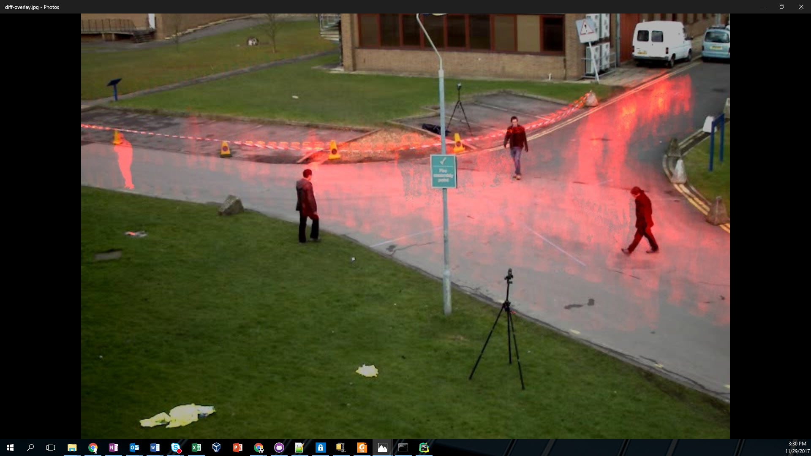

# Motion Heatmap

This sample application is useful to see patterns of movement over time.  For example, it could be used to see the usage of entrances to a factory floor over time, or patterns of shoppers in a store.

## What you’ll learn
  * background subtraction
  * application of a threshold
  * accumulation of changed pixels over time
  * add a color/heat map

## Gather your materials
  *	Python 2.7 or greater
  * OpenCV version 3.3.0 or greater
  *	The vtest.avi video from https://github.com/opencv/opencv/blob/master/samples/data/vtest.avi

## Setup
1. You need the extra modules installed for the MOG background subtractor.  This tutorial was tested on Windows, and the easiest way to install it was using
```
pip install opencv-contrib-python
```
2. Download the vtest.avi video from https://github.com/opencv/opencv/blob/master/samples/data/vtest.avi and put it in the same folder as the python script.
3. Run the python script.  You should see a diff-overlay.jpg when it's done.



## Get the Code
Code is included in this folder of the repository in the .py file.

## How it works
The main APIs used in OpenCV are:  
* MOG background subtractor (cv2.bgsegm.createBackgroundSubtractorMOG()) - https://docs.opencv.org/3.0-beta/modules/video/doc/motion_analysis_and_object_tracking.html?highlight=createbackgroundsubtractormog#createbackgroundsubtractormog  
Note: the docs are out of date, and the propoer way to initialize is  
```
cv2.bgsegm.createBackgroundSubtractorMOG()
```
* cv2.threshold() - https://docs.opencv.org/3.3.1/d7/d4d/tutorial_py_thresholding.html   
* cv2.add() - https://docs.opencv.org/3.2.0/d0/d86/tutorial_py_image_arithmetics.html  
* cv2.applyColorMap() - https://docs.opencv.org/3.0-beta/modules/imgproc/doc/colormaps.html   
* cv2.addWeighted() - https://docs.opencv.org/3.2.0/d0/d86/tutorial_py_image_arithmetics.html  

The application takes each frame and first applies background subtraction using the cv2.bgsegm.createBackgroundSubtractorMOG() object to create a mask.  A threshold is then applied to the mask to remove small amounts of movement, and also to set the accumulation value for each iteration.  The result of the threshold is added to an accumulation image (one that starts out at all zero and gets added to each iteration without removing anything), which is what records the motion.  At the very end, a color map is applied to the accumulated image so it's easier to see the motion.  This colored imaged is then combined with a copy of the first frame using cv2.addWeighted to accomplish the overlay.

IMPORTANT NOTICE: This software is sample software. It is not designed or intended for use in any medical, life-saving or life-sustaining systems, transportation systems, nuclear systems, or for any other mission-critical application in which the failure of the system could lead to critical injury or death. The software may not be fully tested and may contain bugs or errors; it may not be intended or suitable for commercial release. No regulatory approvals for the software have been obtained, and therefore software may not be certified for use in certain countries or environments.